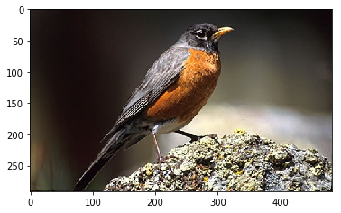

## Intro

Scott Mueller
Co-organizer

smueller.tampa.ai@gmail.com

https://ai-tampa.github.io/prettyingan-presentation

[AI-Tampa on Twitter](https://twitter.com/AiTampa)
---
## Tampa.ai

Looking for Presenters
---
## Study Group

https://ai-tampa-study-group.github.io/meetings/

[AI-Tampa Slack Invite](https://join.slack.com/t/ai-tampa/shared_invite/enQtMzcxOTQ2NjA2NTI5LTM1YzhiMzcyZGFhNGIzNDU3OTBlYTdkNzgxZTM1ODkzNDVjN2FhYmFkYmYzZjI1YmI0NDRmYzY1N2MzMzM2NTM)

---
## Study Group Activities

Discussions on Interesting Events

Show and Tell on Progress

Kaggle Competitions

---
## What are we working on?

Toxic Comment Competition, https://www.kaggle.com/c/jigsaw-toxic-comment-classification-challenge
---
## What have we been working on?

Kaggle Plant Seedling Competition, https://www.kaggle.com/c/plant-seedlings-classification

Restaurant Visitor Forecasting, https://www.kaggle.com/c/recruit-restaurant-visitor-forecasting

---
## Results of Previous Meetings

Our code from previous meetings can be found at:

https://github.com/ai-tampa-study-group

---
# #PrettyInGAN 

Visual Art with AI

Scott Mueller
---

---
## Helena Sarin

https://twitter.com/glagolista

https://www.flickr.com/photos/tarelki/sets/72157694589553071

---

---

---

---

---
## What is Needed?

* Training Data
* Suitable Architecture
* Appropriate Loss Function
* Computer System
    * Nvidia GPU
    * Differentiable Program (Deep Learning) Framework
        * PyTorch, Keras/Tensorflow, etc.

---
## Fast.ai

http://www.fast.ai/ Deep Learning Part 1 & 2

Code examples derived from Lessons

---
## Style Transfer

Convert an image into an image painted in the style of a painting.

---
## Training Data

---
## Loss

3D: Move down the hill, quickest, without going into next valley

Now do the same thing in a million dimensions

---
## Neural Net Layers

---
## Style Loss

How much like the colors, brush strokes, etc?

---
## Content Loss 

How much like the source image?

---
## Uses VGG Architecture

---

---
## Resources
Fast.ai 2018, Lesson 13, http://course.fast.ai/lessons/lesson13.html

https://medium.com/@hiromi_suenaga/deep-learning-2-part-2-lesson-13-43454b21a5d0

https://github.com/ai-tampa-study-group/prettyingan/blob/master/style-transfer-sail-style2.ipynb
---
## Generative Adversarial Network

* Two networks
    
    * Generator creates images

    * Discriminator detects frauds

* Train the two networks together

---

https://towardsdatascience.com/iclr-nvidia-progressive-generative-adversarial-networks-gans-explained-with-art-forgery-b315fe868bcd

---
## Appeal of GANs

* Surprise, randomness of result

    * Some good, some obviously bad

---
## Helena Sarin

---
## SNGAN w Projection

---

---

---

---

---
## Challenges

Mode Collapse

---
Checkerboard

---
## Resources

Fast.ai 2018, Lesson 12, http://course.fast.ai/lessons/lesson12.html

---
## Newer GAN Types

SN-GAN, https://github.com/pfnet-research/sngan_projection

SAGAN, https://towardsdatascience.com/not-just-another-gan-paper-sagan-96e649f01a6b

    https://github.com/heykeetae/Self-Attention-GAN

---
## Cycle GAN

---
## Cycle-consistency Loss

https://towardsdatascience.com/cyclegans-and-pix2pix-5e6a5f0159c4

---
## Two Datasets

Sailboat Pictures ~ 400

Sailboat Watercolor Paintings ~ 400

---
## A lot of processing later

---

---

---
## Comments from Alena Harley
Total datasets are small ~400-500 images in each direction. I modified multiplicative factor of cyclic loss to assign more importance to cyclic loss rather than to the discrimination loss.

I also experimented with dropout, and number of ResNet blocks, mostly to learn the code details. Trained for 200 epochs (~12 hrs on aws p3 instance)

http://forums.fast.ai/t/cycle-gan-art-completing-visual-loop/15279/2
---

---
## Sketch to Art Approach

@glagolisa

---
## Lessons Learned

Model uses a lot of GPU memory.  256px only supports batch size of 1 in 4GB GPU.

Images - TrainA, TrainB, TestA, TestB

Keep Jupyter Connection Live

Progressive growing image size may work

Be prepared to restart Jupyter server.  Probably a small memory leak

---
## Lessons cont'd

Checkpoints directory has incrementally saved models

Changing image size overrides checkpoints of same number. 

    Always starts with 1
--- 
## Resources

Fast.ai 2018, Lesson 12, http://course.fast.ai/lessons/lesson12.html

https://github.com/ai-tampa-study-group/prettyingan/blob/master/cyclegan-growing-gans-256.ipynb

